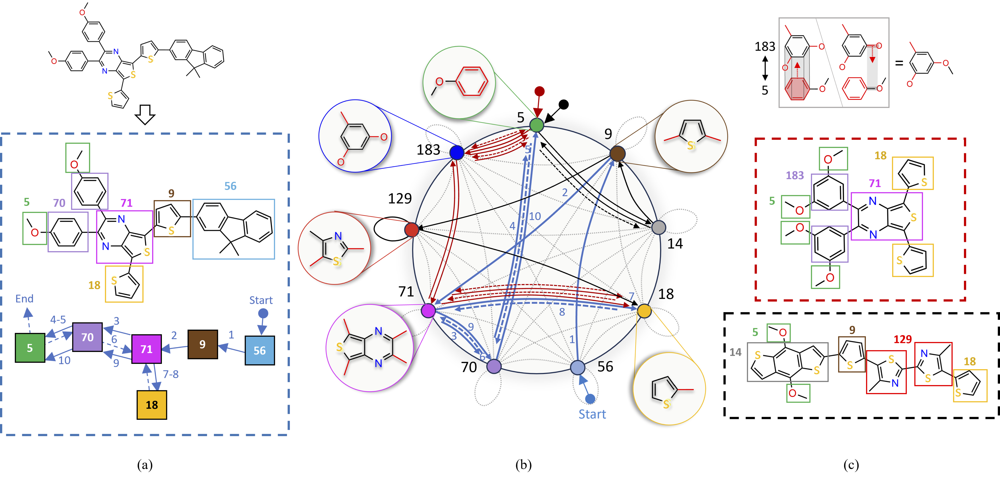
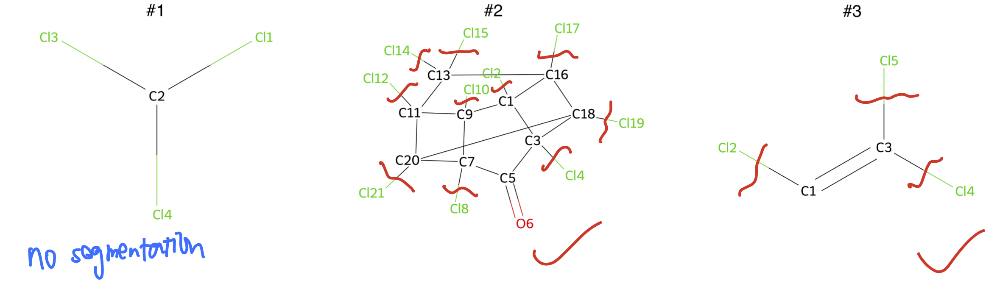

# Polymer walk


*Michael Sun, Minghao Guo, Weize Yuan, Veronika Thost, Crystal Elaine Owens, Aristotle Franklin Grosz, Sharvaa Selvan, Katelyn Zhou, Hassan Mohiuddin, Benjamin J Pedretti, Zachary P Smith, Jie Chen, Wojciech Matusik Proceedings of the 41st International Conference on Machine Learning, PMLR 235:46988-47016, 2024.*

## Setup

Conda is used to create the environment for running polymer_walk.

```bash
# Install environment from file
conda env create -f polymer_walk.yml
```
Set the directory to your motifs:


```bash
export dataset=data/datasets/{name of your dataset}
```

## Data preparation workflow (molecules)

### Option 1: Obtain Motifs from Expert Annotation

Let's walkthrough an example, using the PTC dataset (./datasets/PTC.txt).

Visualize the molecules.
```bash
python get_vocab.py --data_file datasets/PTC.txt --seg_dir $dataset --group_dir $dataset
```
Check inside $dataset/figs/ for the molecule figures. There's a grid view of all molecules at $dataset/figs/grid.png. Send this to your chemist friend. Ask them to identify the bonds to break for each molecule. Here's a screenshot of what our chemist friend returned to us.



The annotations should be typed up in a separate file. Here's what the start of the file looks for PTC.

```
2 21,20 21 7,9,11,20
2 8,7 8 1,3,5,7,9
2 12,11 12 7,9,11,20
2 14,13 14 11,13,16,18,20
2 15,13 15 11,13,16,18,20
2 10,9 10 1,3,5,7,9
2 2,1 2 1,3,5,7,9
2 17,16 17 1,3,16,18
2 19,18 19 1,3,16,18
2 4,3 4 1,3,5,7,9
3 2,1 ; ;
3 5,3 ; ;
3 3,4 ; ;
```
The general syntax is [ID] [a,b] [a_1,...,a_i] [b_1,...,b_j] where:
* ID: 1-indexed id of the molecule
* a,b: atom pair indicating bond to break
* a_1,...,a_i: comma-separated list of atoms to include in red group, has to include a
* b_1,...,b_j: similar for b

There are a few things to note.

1. If no bonds should be broken, i.e. the whole molecule is a motif, don't include its ID in the file.
2. Writing ; as the red group triggers the program to infer the red group using simple heuristics (like a single atom or ring).
3. **Ensure a and b belong to separate fragments after breaking all the bonds.** If not, delete the line or add additional bonds to break.

Our annotations for HOPV and PTC are found under datasets/.


Process the annotations.
```bash
python get_vocab.py --data_file datasets/PTC.txt --seg_dir $dataset --group_dir $dataset --do_seg --annotation_file {path to your annotation file}
```

### Option 2: Extract Motifs from Heuristic Algorithm
```bash
python get_heuristic_motifs.py --group_dir $dataset --data_file {path to your file of SMILES}
```


## Data preparation workflow (polymers)

Create a directory for the motifs. 
```
data/datasets/{dataset}/
└───walks_new/
│   │   *.edgelist
└───all_groups/
│   │   *.mol
│   │   all_extra.txt
│   └───with_label/
│       │   *.png
```
A dataset of random walks on the motif graph can be provided as a text file. 

For example, data/polymer_walks_v2_preprocess.txt
has examples of the following form:
```bash
PIM-1 L3-2>S32-2>S20[-1>S1,-4>S1]-2>S32-2>L3 (1300,92,370,125,2300) # property vals
```
where L3, S32, S20 are names of groups under all_groups/ and -{j}> is the j-th edge on the motif graph, which is a digraph with multiedges.


## Data preprocessing


Go to the top of utils/graph.py and utils/preprocess.py and toggle between group folders, as needed.

### Build the motif graph. 
```bash
python walk_grammar.py --motifs_folder $dataset/all_groups/ --extra_label_path $dataset/all_groups/all_extra.txt --out_path $dataset/red_graph.adjlist
```

### Preprocess existing random walks (molecules).
```bash
python construct_graph.py --data_file $dataset/walks --graph_vis_file $dataset/polymer_walk.png --predefined_graph_file $dataset/red_graph.edgelist --extra_label_path $dataset/all_groups/all_extra.txt --motifs_folder $dataset/all_groups/ --out_path $dataset/dags.pkl
```

### Preprocess existing random walks (polymers).

```bash
python construct_graph.py --data_file data/polymer_walks_v2_preprocess.txt --graph_vis_file $dataset/polymer_walk.png --predefined_graph_file $dataset/red_graph.edgelist --extra_label_path $dataset/all_groups/all_extra.txt --motifs_folder $dataset/all_groups/ --out_path $dataset/dags.pkl --extract_edges --save_edges_dir $dataset/walks_new/
```

Remove --extract_edges if your .txt file has no edge info (e.g. L3->S32->S20[->S1,->S1]->S32->L3). The algorithm will guess the edges, but will not guarantee validity.

### Train graph diffusion grammar. 
```bash
python diffusion.py --data_file {data/polymer_walks_v2_preprocess.txt | $dataset/walks} --motifs_folder $dataset/all_groups/ --extra_label_path $dataset/all_groups/all_extra.txt --dags_file $dataset/dags.pkl --predefined_graph_file $dataset/red_graph.edgelist --num_epochs 10000 --alpha 1e-1 --context_L
```
The artifacts are saved under logs/, e.g. logs-1695308013.8280082/.

### Train property predictor. 
```bash
python main.py --motifs_folder $dataset/all_groups/ --extra_label_path $dataset/all_groups/all_extra.txt --grammar_folder logs/logs-1695308013.8280082 --predefined_graph_file $dataset/red_graph.edgelist --dags_file $dataset/dags.pkl --num_epochs 1000 --walks_file {data/polymer_walks_v2_preprocess.txt | $dataset/walks}
```

The predictor is saved under grammar_folder, e.g. predictor_1696440075.4187388. 

Sample novel ones from grammar checkpoint.
```bash
python diffusion.py --data_file {data/polymer_walks_v2_preprocess.txt | $dataset/walks} --motifs_folder $dataset/all_groups/ --extra_label_path $dataset/all_groups/all_extra.txt --dags_file $dataset/dags.pkl --predefined_graph_file $dataset/red_graph.edgelist --num_epochs 2000 --context_L --alpha 1e-1 --log_folder logs/logs-1695308013.8280082
```

Do property-driven sampling.
```bash
python main.py --motifs_folder $dataset/all_groups/ --extra_label_path $dataset/all_groups/all_extra.txt --grammar_folder logs/logs-1695308013.8280082 --predefined_graph_file $dataset/red_graph.edgelist --dags_file $dataset/dags.pkl --num_epochs 1000 --walks_file {data/polymer_walks_v2_preprocess.txt | $dataset/walks} --predictor_file logs/logs-1695308013.8280082/predictor_1696440075.4187388/predictor_ckpt_0.007912156573847579.pt --grammar_file logs/logs-1695308013.8280082/predictor_1696440075.4187388/grammar_ckpt_0.007912156573847579.pt
```
